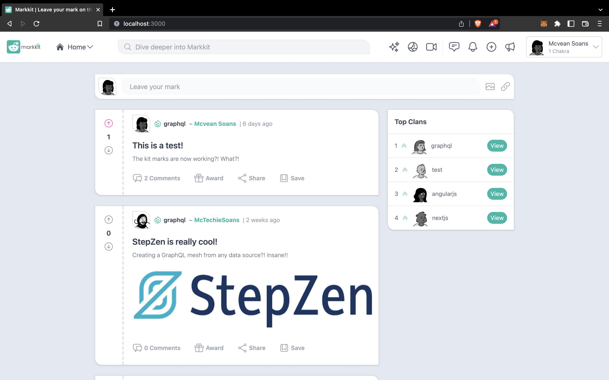
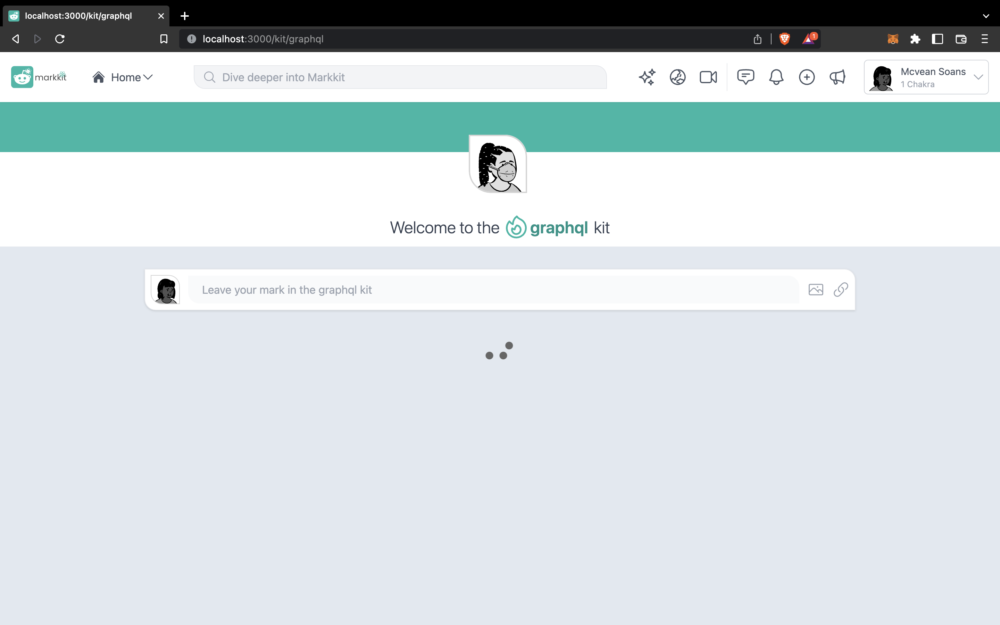
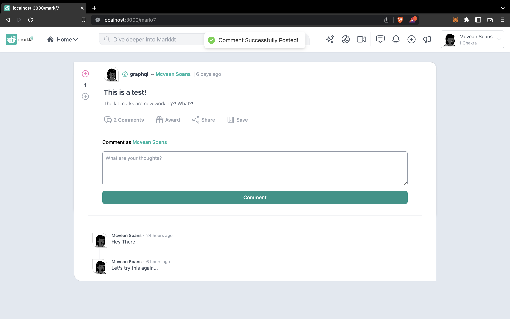
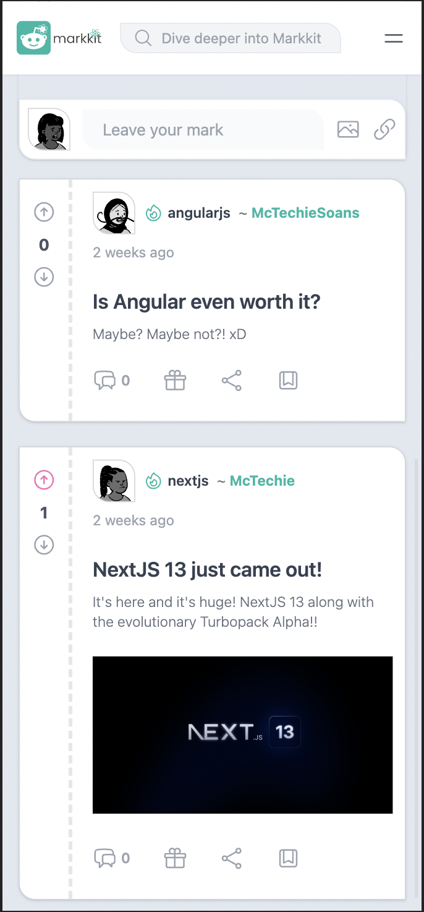

<h1 align="center">
  Markkit
</h1>

  
  
  
  
  
  
  
  

> A full-stack Micro-blogging app created using NextJS by **McTechie** 👨‍🎨✨

## Concepts Covered

- NextJS Frontend
  - [x] Robust build using TypeScript
  - [x] OAuth Authentication using NextAuth
  - [x] Form Validations using React Hook Form
- GraphQL Backend
  - [x] Apollo Client for interacting with the GraphQL mesh
  - [x] GraphQL Queries and Mutations
  - [x] PostgreSQL Database (Supabase)
  - [x] StepZen connecting to the Supabase database

---

## Preview

### Landing Screen

---

### Developed with UX in mind

---

### Complete CRUD Functionality for Comments and Votes

---

### Completely Responsive for various Screen Sizes

